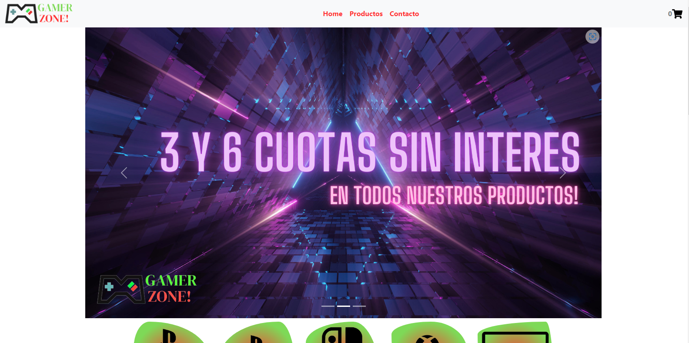
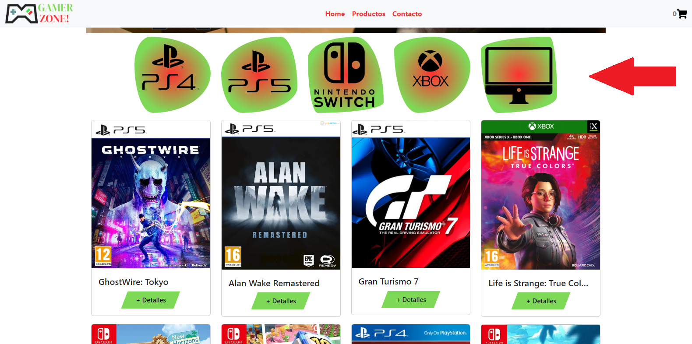
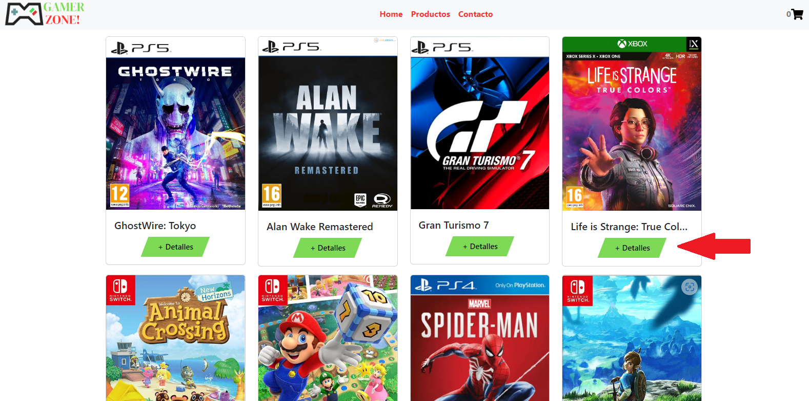
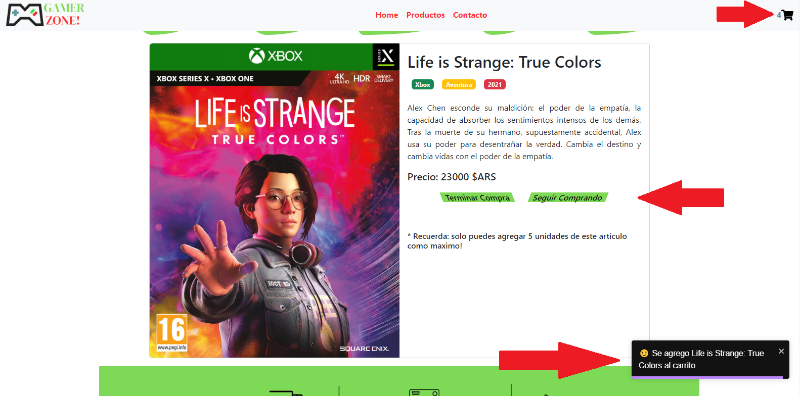

<h1>Proyecto Final Curso ReactJS Comision 39660 CoderHouse </h1>

<h4> ✅ Demo de la Aplicacion:  <a href="http://gamerzone-reactjs.netlify.app/"> http://gamerzone-reactjs.netlify.app/  </a></h4>

Imagen de la pantalla principal de la pagina:

<h2> Para el desarrollo de esta aplicacion se aplicaron las siguientes herramientas y dependencia: </h2>

- Bootstrap.
- CSS3.
- SASS.
- Github.
- Netlify para el deploy.

### Dependencias usadas:

👍 React <strong>v18.2.0</strong>: 
Framework de Js para el desarrollo de aplicaciones.Especificamente de react se usaron los hooks, estados, promesas, contexto y mas.

👍 Vite <strong>v4.2.0</strong>: 
Es usado ya que es una herramienta de compilacion que tiene como objetivo proporcionar una experiencia de desarrollo mas rapida y agil para proyectos web modernos.

👍 Firebase - Firestore <strong> v.9.21.0 </strong>: 
 Se uso para alojar nuestra base de datos no relacional, donde se guardo nuestros productos como asi mismo la orden creada por el usuario de la aplicacio, en esta orden se genera el id, nombre y apellido del comprador, correo y telefono, como tambien los items compramos y el total de la compra.

👍 React Router Dom <strong>v6.10.0</strong>: 
Se uso para facilitar la navegacion en nuestra app y que sea una SPA.

👍 React Bootstrap <strong>v2.7.2</strong>: 
Para la maquetacion de componentes donde nos permite hacer un maquetado responsive.

👍 React Icons <strong>v4.8.0</strong>: 
Para el uso de iconos de diferentes librerias.

👍 React Toastify <strong>v9.1.2</strong>:
 Para las notificaciones dinamicas en la app.

<h2> Funciones de la Aplicacion </h2>

La applicacion consiste en una ecommerce de venta de videojuegos para las diferentes consolas del momento.

Al entrar a la aplicacion podes ver un banner de nuestras diferentes promociones en forma de slide.

Luego de eso podes ver unos botones donde podes filtrar los productos por consola.

Para ver el detalle del videojuego puedes presionar en la imagen del mismo o en el boton que dice "+ Detalles".

Cuando presiones cualquiera de los dos opciones vas a poder ver el detalle del articulo, nombre, precio, de que plataforma es, a que genero corresponde, la descripcion y su año de lanzamiento. En el detalle del ariculo podras seleccionar como maximo la cantidad de 5 unidades del articulo y presionar el boton de agregar al carro.

luego de agregado al carro te saltara una notificacion de que fue agregado el articulo al carrito de compras.

Para ver los articulos agregados al carrito puedes hacer click en el icono del carrito que se encuentra en la navbar .

Si quieres eliminar una unidad del articulo del carrito puedes buscar en el articulo un signo de "-" de color rojo. Si quieres eliminar toda la cantidad del articulo solo tienes que presionar el icono de la basura.

Luego de eliminar una unidad o el articulo completo podras ver una notificacion indicandolo.

Si quieres vaciar el carrito completo puedes presionar el boton que dice "Vaciar Carrito" asi mismo te saldra una notificacion que te dira la accion realizada. Si quieres proceder con al compra puedes presionar el boton que dice finalizar.

El mismo boton te llevara a un formulario donde tendras que llenar los campos (todos) para proceder a generar tu orden.

Luego de completar todos los campos y pasar la verificacion de los correos puedes presionar el boton de generar orden.

Generada la orden te aparecera en pantalla el id de la orden que te servira para identificar tu pedido.

El carrito quedara vacio y te dira que te dirijas al home si quieres comprar algun producto.

<h3>Espero estas instrucciones te ayuden y que disfrutes este proyecto</h3>
